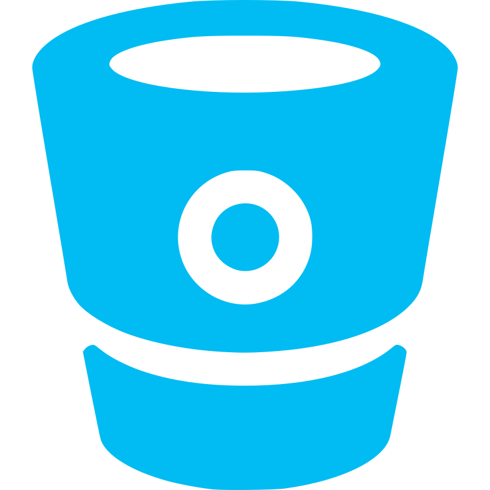

<h1 align="center">Hi 👋, I'm Samyak Mehta</h1>

<h3 align="center">A Young & Enthusiastic Full Stack Developer from India</h3>

 

- 💬 I’m currently exploring new technologies like **NextJS, Docker**

- 📫 Reach me at **samyak.mehta11@gmail.com**

- 😀 Visit my website at <a href="https://samyak-mehta.web.app" target="_blank">**_Samyak Mehta_**</a>

- ⚡ Fun fact **"Coffee in winter tastes way better than Coffee in summer!"**

 

## About Me:

I am a passionate and dedicated Full Stack Developer from India. I love building web applications and creating intuitive user experiences. With a strong foundation in both front-end and back-end development, I enjoy working on various technologies and constantly expanding my skill set.

 

## Connect with me:

  

  

 

## Languages and Tools :

### Frontend & Backend Web

  
    
  
  
    
   
   
   
   

### Programming Languages

  
    
    
    
    
    

### Version Control / Web Services / Tools :

  
  
  
  
  
  

 
 

 
   

